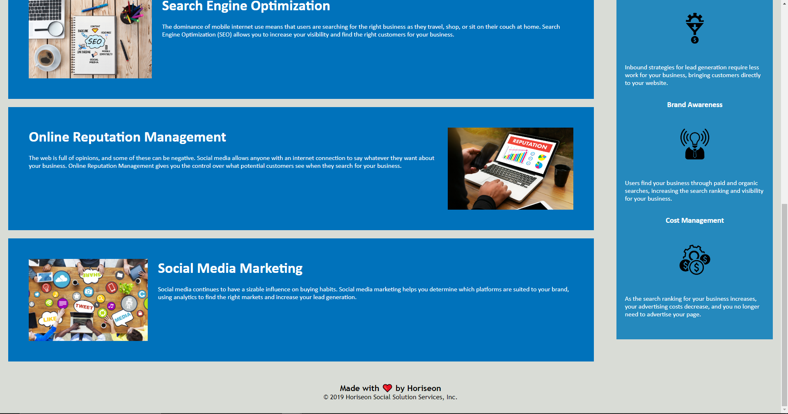

# refactoring-challenge
week one challenge assigment
# Description 

This project is the week one challenge involving refactoring the code of a premade website to better reflect proper HTML semantics as well as CSS practise and commentaion

# Screenshot 

# Link to Website

[DeployedWebsite](https://connorg24.github.io/refactoring-challenge/)